# Nardus Mollentze

[](https://github.com/anuraghazra/github-readme-stats#gh-dark-mode-only)
[](https://github.com/anuraghazra/github-readme-stats#gh-light-mode-only)

## Analysis pipelines
[](https://github.com/nardus/ace2#gh-dark-mode-only)
[](https://github.com/viralemergence/haystack#gh-dark-mode-only)
[](https://github.com/nardus/zoonotic_rank#gh-dark-mode-only)
[](https://github.com/nardus/hiv_growth_rates#gh-dark-mode-only)
[](https://github.com/nardus/isg_composition#gh-dark-mode-only)

[](https://github.com/viralemergence/haystack#gh-light-mode-only)
[](https://github.com/nardus/zoonotic_rank#gh-light-mode-only)
[](https://github.com/nardus/hiv_growth_rates#gh-light-mode-only)
[](https://github.com/nardus/isg_composition#gh-light-mode-only)

## Libraries

[](https://github.com/nardus/geo_features#gh-dark-mode-only)

